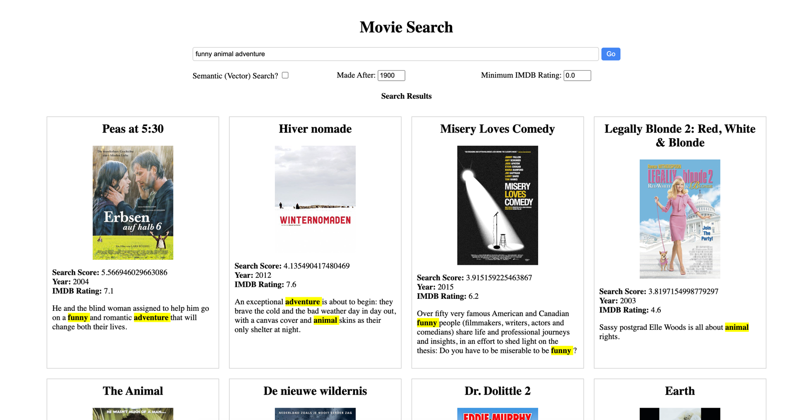
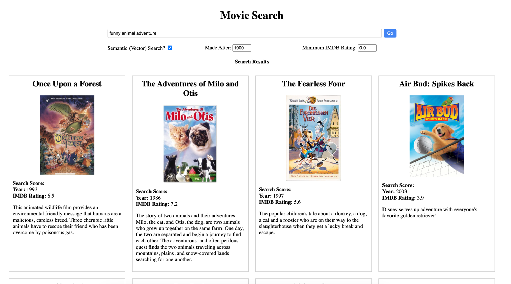

# Atlas Vector Search - A simple demo
In this demo we will use the sample_mflix.movies collection and create two search indexes on the *fullplot* field. One will be a standard search index and the other will be a vector search index using the **all-MiniLM-L6-v2** transformer from huggingface details of which you can find [here](https://huggingface.co/sentence-transformers/all-MiniLM-L6-v2).

## Setup
This demo uses a simple web application writtn in python using the flask framework. So ensure you have python3 installed and run the following to install the necessary dependencies:

```
pip install -U sentence-transformers pymongo Flask
```

You can then use a fully managed [MongoDB Atlas](https://www.mongodb.com/docs/atlas/) environment or the [Atlas CLI](https://www.mongodb.com/docs/atlas/cli/stable/) to set up a local Atlas development environment.

#### Atlas CLI
This dmeo can be run entirely on your laptop using the [Atlas CLI](https://www.mongodb.com/docs/atlas/cli/stable/). To do this, follow the steps in the [docs](https://www.mongodb.com/docs/atlas/cli/stable/atlas-cli-deploy-local/) to install the prerequisites for running Atlas CLI in local development mode.

Then, create the local database by running the following commands and accepting the default values:

```
atlas deployments setup
```

You can view your deployments using this command:

```
atlas deployments list
```

Then locate the connection string for your local Atlas cluster using:
```
atlas deployments connect
```

Finally, unzip the [movieData.json.zip](movieData.json.zip) file and import the sample colleciton from the movies database using the following command (remembering to replace the name of the **_uri_** with the one for your environment):

```
mongoimport --uri "mongodb://localhost:27017" -d sample_mflix -c movies --file movieData.json
```

Once successfully imported, we will need to create the Atlas search and vector indexes. This will also be done via the Atlas CLI using the configuration defined in the [searchIndex.json](searchIndex.json) and [vectorSearchIndex.json](vectorSearchIndex.json) files.

Create search & vector search indexes using:

```
atlas deployments search indexes create --deploymentName <yourDeploymentName> --file searchIndex.json
atlas deployments search indexes create --deploymentName <yourDeploymentName> --file vectorSearchIndex.json
```

Your local deployment is now ready to be used for this demo.

#### MongoDB Atlas
To run this demo using an Atlas cluster, either follow the [getting started](https://www.mongodb.com/docs/atlas/getting-started/) steps to provision your cluster (note this can run on an M0 which is free) or use an existing cluster.

Note: If you want to run this on a the sample data set loaded in Atlas it is possible to generate the vector embeddings stored for the fullplot field and add this to the collection. To do this, modify and execute the [setupVectorSearch.py](setupVectorSearch.py) script. This will take a few minutes to run.

Alternatively, unzip the [movieData.json.zip](movieData.json.zip) file and import the sample colleciton from the movies database using the following command (remembering to replace the name of the **_uri_** with the one for your Atlas environment). Feel free to change the names of the database/collection if you already have the sample dataset loaded and don't want to replace it (but then remember to modify the details in [settings.py](settings.py)).

```
mongoimport --uri "mongodb+srv://<username>:<password>@YourAtlasCluster.foo.mongodb.net" -d sample_mflix -c movies --file movieData.json
```

Once you have the data in the movies collection, navigate to the Atlas Search consle and ensure you have a search index created on the *fullplot* field (call this index "default") and an index created on the *vectorPlot* field (call this index "vectorIndex"). Here are the JSON configurations for both these indexes:

```
{
  "mappings": {
    "dynamic": false,
    "fields": {
      "fullplot": {
        "type": "string"
      },
      "imdb": {
        "type": "document",
        "fields": {
          "rating": {
            "type": "number"
          }
        }
      },
      "year": {
        "type": "number"
      }
  }
  }
}
```

```
{
  "mappings": {
    "dynamic": false,
    "fields": [
      {
        "type": "vector",
        "path": "vectorPlot",
        "numDimensions": 384,
        "similarity": "euclidean"
      },
      {
        "type": "filter",
        "path": "imdb.rating"
      },
      {
        "type": "filter",
        "path": "year"
      }
    ]
  }
}
```
Of course you can create these indexes using the Atlas CLI if you prefer in a similar way to the instructions above if that's your preference.

### Run
Before running the demo ensure you have updated the Atlas connection details (and database/collection names if you've change them during the import) in [settings.py](settings.py) to match your environment.

To run the demo, navigate to this directory and execute the following command:

```
python3 app.py
```

This will launch the application on the default endpoint which is [http://127.0.0.1:5000](http://127.0.0.1:5000)


The demo script itself is relatively simple, enter some search criteria for the types of movies you want to see and show the difference between the traditional search (which uses tokenisers and inverted indexes to identify relevant results) and vector search (which uses transformers based on ML models to return contextually relevant results). Additionally you can apply filters to retrieve films made after a certain year or wiht an IMDB rating higher than a certain value.

A good example of this would be to search for  "funny animal adventure" and you'll see the different results:

#### Regular Search

#### Semantic/Vector Search
